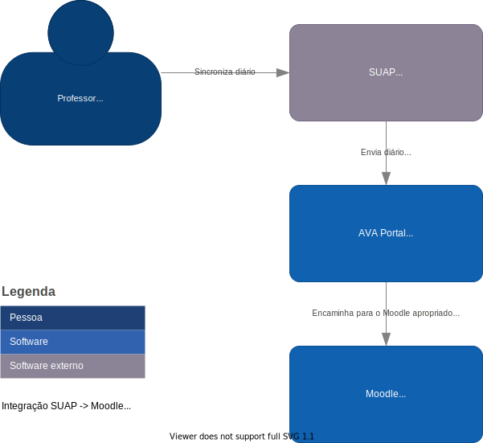
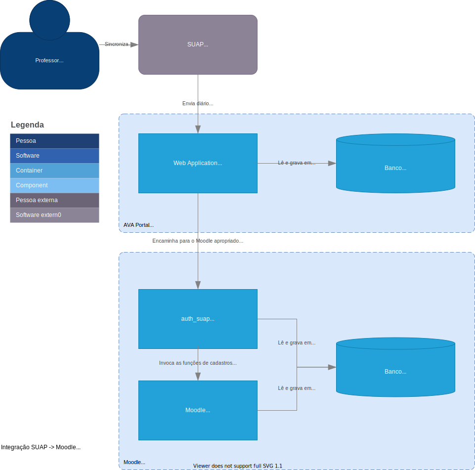
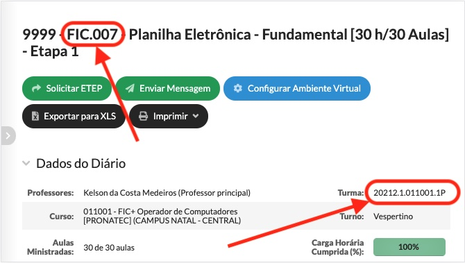

# Ecossistema do CTE/ZL/IFRN

A CTE/DEAD/ZL/IFRN utiliza um ecossistema de aplicações para suportar o AVA do IFRN. Aqui você encontra uma visão de como este ecossistema foi arquitetado para que você possa tentar se inspirar e reproduzir em seu ambiente a fim de melhorar a oferta de serviço AVA a sua comunidade acadêmica.

### Para quem tem pressa

Se você não tem tempo e já tem noção do que é este ecossistema, segue a documentação rápida do que fazer. Aaqui não teremos os manuais de instalação do Moodle, do Plugin auth_suap ou do SUAP, para isso, consulte os manuais dos mesmos.

### Links úteis

* [Diretório de plugins do Moodle do auth_suap](https://github.com/cte-zl-ifrn/moodle__auth_suap).
* [Repositório no GitHub do auth_suap](https://github.com/cte-zl-ifrn/moodle__auth_suap).
* [Pepositório no GitHub do Portal AVA](https://github.com/cte-zl-ifrn/portal__ava).
* [Repositório no GitLab do SUAP no IFRN](https://gitlab.ifrn.edu.br/cosinf/suap).

> Primeiro sua organização deverá ter um termo de cooperação com o IFRN antes que você tenha acesso ao fonte do SUAP.

### No Moodle

Instale o **Plugin auth_suap** do diretório de plugins do Moodle ou direto do fonte no GitHub conforme o README do software. Acesse a página de configurações do plugin em `%MOODLE_ROOT_URL%/admin/settings.php?section=authsettingsuap` e copie o valor da configuração `sync_up_auth_token` que foi gerado automaticamente na instalação (lembre que você pode informar outro, se quiser). Repita este passo para cada Moodle que você tem instaldo.

### No Portal AVA

Depois de colocar o [Portal AVA](https://github.com/cte-zl-ifrn/portal__ava) para executar conforme o README do software, configure ao menos a variável de ambiente `SUAP_EAD_KEY` em `confs/enabled/avaportal.env`. Outras configurações serão necessárias, esta é necessária para a autenticação do SUAP neste serviço.

Copie a URL raiz do Moodle e o token de autenticação do passo anterior e cadastre em `%PORTAL_ROOT_URL%/admin/avaportal/campus/`. Faça isso para cada Moodle com o qual queres integrar.

> Atualmente é necessário cadastrar um Moodle por campi, se você tem um mesmo Moodle para mais de um campus, cadastre cada campi individualmente e informe a mesma URL e o mesmo token.

### No SUAP

Edite o `local_settings.py` de tua instalação e defina ao menos as configurações:

* `MOODLE_SYNC_URL` com a URL raiz do AVA_PORTAL (ex.: "https://ava.if.edu.br/moodle/").
* `MOODLE_SYNC_TOKEN` com o valor que foi o que você especificou no **Portal AVA**, arquivo `confs/enabled/avaportal.env`, variável de ambiente `SUAP_EAD_KEY`.

## Arquitetura

Estes diagramas foram construídos usando o https://app.diagrams.net/ e podem ser [baixado daqui](media/integracao_suap_moodle.drawio) para sua própria edição. Ele se baseia no [C4 Model](c4_model) com a descrição dos tipos de diagramas descritos de forma super simplificada aqui.

### Contexto

Este ecossistema é composto por 3 aplicações, [SUAP](https://gitlab.ifrn.edu.br/cosinf/suap), [Portal](https://github.com/cte-zl-ifrn/portal__ava) e [Plugin](https://github.com/cte-zl-ifrn/moodle__auth_suap) (ou, se preferir, (baixe o fonte](https://github.com/cte-zl-ifrn/moodle__auth_suap))):

1. **SUAP** - Sistema responsável por gerir as matrículas de alunos em diários.
2. **Portal AVA** - Middleware responsável orquestrar para qual **Moodle** a sincronização do diário deve ir. Também faz as vezes de um portal de Moodles.
3. **Plugin auth_suap do Moodle** - Plataforma responsável por receber a requisição de sincronização vinda do **Portal** e criar os usuários (docentes e discentes), categorias, curso e grupo (1 para cada pólo), depois inscreve os alunos e professores em seus respectivos papéis e agrupa os alunos nos grupos de seus respectivos grupos.

### Containers

## Identificando um código de diário

> No SUAP um curso é formado por vários componentes currículares que são ofertados em períodos na forma de turmas, isto gera um código único de diário.
>
> O código do diário é formado pela concateção do código da turma e pelo código do componente currícular, separados por ".". No exemplo abaixo o código do diário seria "20212.1.011001.1P.FIC007", onde:
>
> * **20212.1.011001.1P** - *código da turma*, onde:
>   * **20212** - *ano/período de oferta do componente*, no caso, ofertado em 2021, período 2.
>   * **1** - *período da turma*, no caso, esta e é o primeiro perído do turma, ou seja, a turma se iniciou no 2º período de 2021 mesmo.
>   * **011001** - *código do curso*, no caso, é o código do curso de "Operador de sistemas".
>   * **1P** - *identificação da turma*, no caso, é arbitrado pela área acadêmica do campus/instituição.
> * **FIC007** - *código do componente currícular*, no caso, FIC007 indicaria o componente "Planilhas eletrônicas - Fundamental".
>
> A imagem abaixo foi posta para facilitar a identificação de onde as partes do código do diário ficam apresentadas no SUAP.
>
> 

## Como usar o Sentry com o Moodle

Escrevam aqui.

## Quem somos

* **CTE** - [Coordenação de Tecnologias da Educação](https://ead.ifrn.edu.br/portal/institucional/estrutura-administrativa/dg/dead/te/)
* **DEAD** - [Diretoria de Educação a Distância](https://ead.ifrn.edu.br/portal/institucional/estrutura-administrativa/dg/dead/)
* **ZL** - [Campus Avançado Nata-Zona Leste](https://ead.ifrn.edu.br/portal/)
* **IFRN** - [Instituto Federal de Educação, Ciência e Tecnologia do Rio Grande do Norte](https://ifrn.edu.br/).
