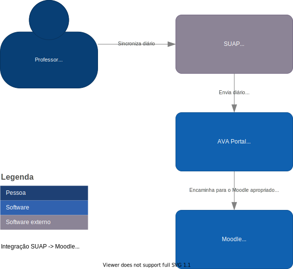

# Sobre o modelo C4

Neste documento será utilizada a proposta descrita no [C4 model](https://c4model.com/), a qual é descrita como um modelo com hierárquico de 4 níveis de "diagramas de arquitetura de software" dividido em **contexto, container, componente e código**, onde cada nível "fornece diferentes níveis de abstração, cada um dos quais é relevante para um público diferente". Sem prescrição de notação específica, não necessita de ferramentas para diagramação, podendo inclusive ser feito com um quadro branco ou mesmo a UML.

Independentemente da notação que você usa, recomenda-se que cada elemento inclua um **nome**, o **tipo de elemento** (ou seja, "Pessoa", "Sistema de Software", "Container" ou "Componente"), uma opção de **tecnologia** (se apropriado) e algum **texto descritivo**.

Certifique-se de ter legenda para descreva a notação que esteja usando. Isso deve abranger cores, formas, acrônimos, estilos de linha, bordas, dimensionamento, etc. Use a mesma notação em todos os níveis de detalhe.

## Nível 1: Contexto do sistema

O nível 1, um diagrama de contexto do sistema, mostra o sistema de software que você está construindo e como ele se encaixa no mundo em termos das pessoas que o utilizam e dos outros sistemas de software com os quais ele interage.

## Nível 2: Containers

O nível 2, um diagrama de container, amplia o sistema de software e mostra os containers (aplicativos, armazenamentos de dados, microservices, etc.) que compõem esse sistema de software. As decisões de tecnologia também são uma parte fundamental desse diagrama.

## Nível 3: Componentes

O nível 3, um diagrama de componentes, amplia um container individual para mostrar os componentes dentro dele. Esses componentes devem mapear para abstrações reais (por exemplo, um agrupamento de código) em sua base de código. *Ainda não usamos neste projeto dado ser 1x1 como container*.

## Nível 4: Códigos

O nível 4, um diagrama de classes, amplia um componente individual para mostrar as classes dentro dele. *Ainda não usamos neste projeto.*

## Arquitetura

Estes diagramas foram construídos usando o https://app.diagrams.net/ e podem ser [baixado daqui](media/integracao_suap_moodle.drawio).

### Contexto

Este ecossistema é composto por 3 aplicações, SUAP, [Portal](https://github.com/cte-zl-ifrn/portal__ava) e [Plugin](https://github.com/cte-zl-ifrn/moodle__auth_suap):

1. **SUAP** - Responsável por gerir a situação acadêmica dos alunos. No SUAP um curso é formado por vários componentes currículares.
2. **Portal AVA** - Responsável orquestrar para qual **Moodle** o sincronização do diário deve ir. Funciona como um middleware e acrescenta a funcionalidade de portal.
3. **Plugin auth_suap do Moodle** - Responsável receber a requisição de sincronização vinda do **Portal** e criar os usuários (docentes e discentes), categorias, curso e grupo (1 para cada pólo), depois inscreve os alunos e professores em seus respectivos papéis e agrupa os alunos nos grupos de seus respectivos grupos.

### Containers

