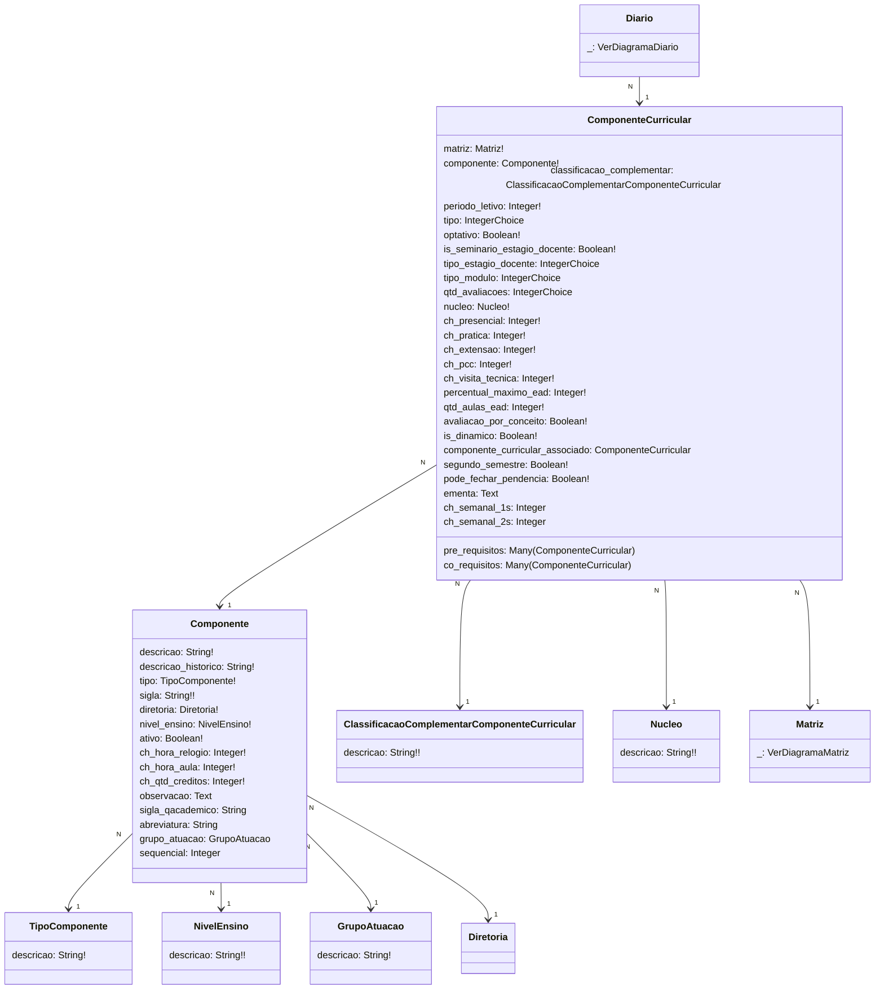

# SUAP Edu

## Componente - Digrama

> **ComponenteCurricular**
> 1. tipo = `[[1, 'Regular'], [2, 'Seminário'], [3, 'Prática Profissional'], [4, 'Trabalho de Conclusão de Curso'], [5, 'Atividade de Extensão'], [6, 'Prática como Componente Curricular'], [7, 'Visita Técnica / Aula da Campo'], [8, 'Componentes Extracurriculares']]`
> 2. tipo_estagio_docente = `[[1, 'Estágio Docente I'], [2, 'Estágio Docente II'], [3, 'Estágio Docente III'], [4, 'Estágio Docente IV'], [5, 'Estágio Docente de Matriz Anterior']]`
> 3. tipo_modulo = `[[1, 'Módulo I'], [2, 'Módulo II'], [3, 'Módulo III'], [4, 'Módulo IV'], [5, 'Módulo V'], [6, 'Módulo VI'], [7, 'Módulo VII'], [8, 'Módulo VIII'], [9, 'Módulo IX'], [10, 'Módulo X'], [11, 'Módulo XI'], [12, 'Módulo XII']]`
> 4. qtd_avaliacoes = `[[0, 'Zero'], [1, 'Uma'], [2, 'Duas'], [3, 'Três'], [4, 'Quatro']]`