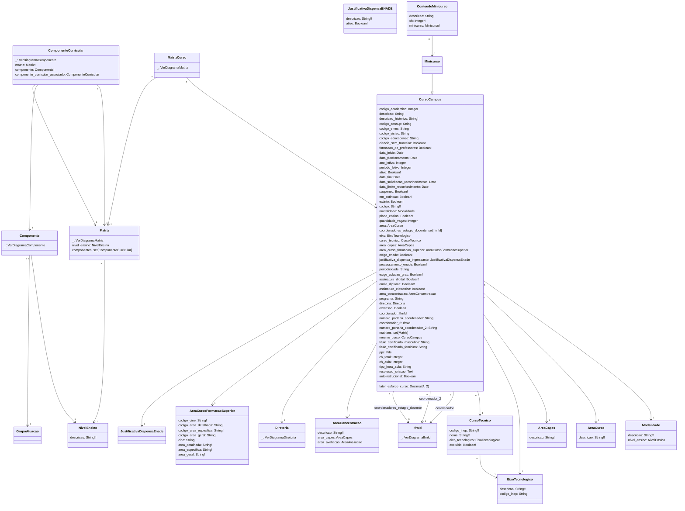

# SUAP Edu

## Curso - Digrama

> **Curso**
> 1. periodo_letivo= `[[1, '1'], [2, '2']]`
> 2. periodicidade= `[[1, 'Anual'], [2, 'Semestral'], [3, 'Livre']]`
> 3. tipo_hora_aula= `[[45, '45 min'], [60, '60 min']]`

## Observações

1. Os models abaixo não foram utilizados pois não pareceram ter relevância para a integração:
   1. `edu.cursos.EstruturaCurso`
   2. `edu.cursos.Habilitacao`
   3. `edu.cursos.RepresentacaoConceitual`
   4. `edu.cursos.EquivalenciaComponenteQAcademico`
   5. `edu.cursos.Autorizacao`
   6. `edu.cursos.Reconhecimento`
   7. `edu.cursos.ConfiguracaoCertificacaoParcial`
   8. `edu.cursos.ComponenteCurricularCertificacaoParcial`
