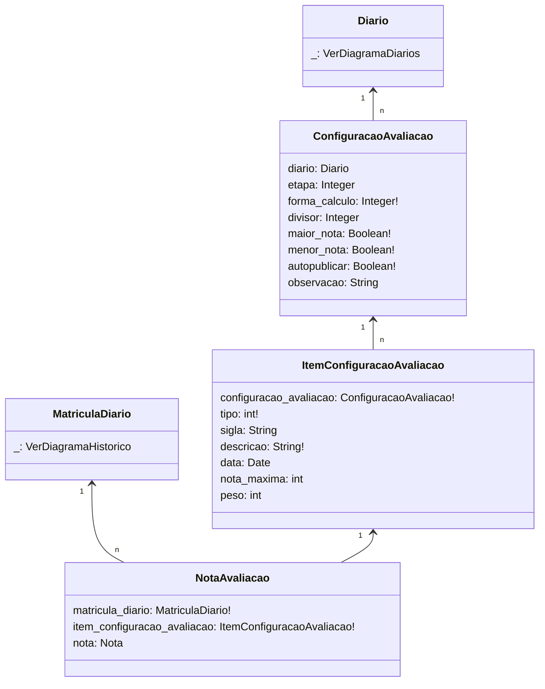

# SUAP Edu - Diários

## Digrama

## Choices

> **ConfiguracaoAvaliacao**
> 1. tipo=[[1, 'Soma Simples'], [2, 'Média Aritmética'], [3, 'Média Ponderada'], [4, 'Maior Nota'], [5, 'Soma com Divisor Informado'], [6, 'Média Atitudinal'], [7, 'Avaliação por Conceito']]

> **ItemConfiguracaoAvaliacao**
> 1. tipo=`[[1, 'Trabalho'], [2, 'Seminário'], [3, 'Teste'], [4, 'Prova'], [5, 'Atividade'],  [6, 'Exercício'], [7, 'Atitudinal']]`
