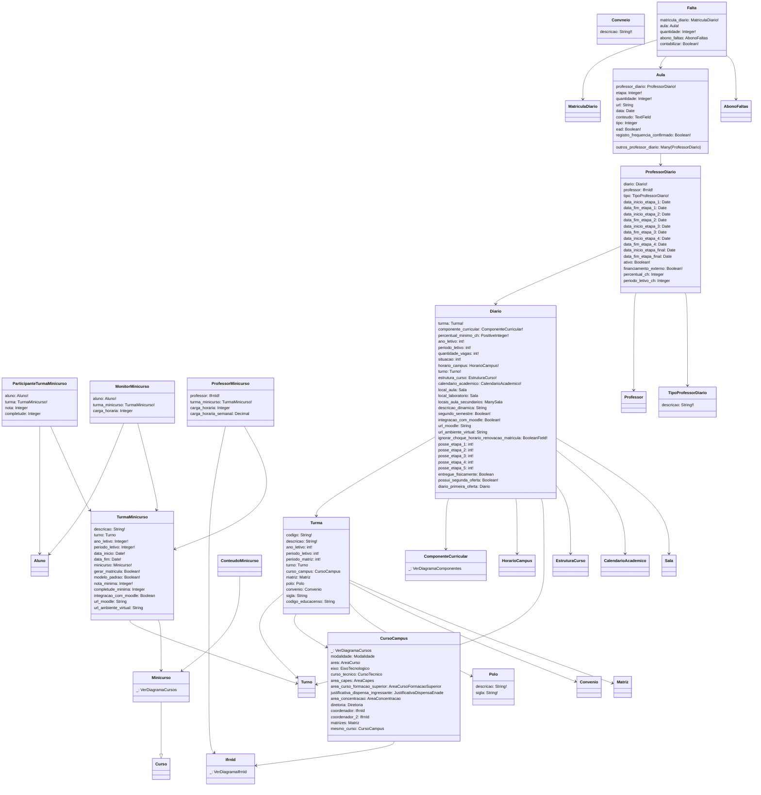

# SUAP Edu - Diários

## Digrama

## Choices
> **Diario**
> 1. situacao=`[[1, 'Aberto'], [2, 'Fechado']]`
> 2. posse_etapa_1, posse_etapa_2, posse_etapa_3, posse_etapa_4, posse_etapa_5=`[[1, 'Professor'], [0, 'Registro Escolar']]`
> 3. etapa=`[[1, 'Etapa 1'], [2, 'Etapa 2'], [3, 'Etapa 3'], [4, 'Etapa 4'], [5, 'Etapa Final']]`

> **Aula**
> 1. etapa=`[[1, 'Primeira'], [2, 'Segunda'], [3, 'Terceira'], [4, 'Quarta'], [5, 'Final']]`
> 2. tipo=`[[1, 'Teórica'], [2, 'Prática'], [3, 'Extensão'], [4, 'Prática como Componente Curricular'], [5, 'Visita Técnica/Aula de Campo']]`

## Observações

1. Os models abaixo não foram utilizados pois não pareceram ter relevância para a integração:
   1. `edu.diarios.ObservacaoDiario`
   1. `edu.diarios.OcorrenciaDiario`
   1. `edu.diarios.MaterialAula`
   1. `edu.diarios.MaterialDiario`
   1. `edu.diarios.Trabalho`
   1. `edu.diarios.EntregaTrabalho`
   1. `edu.diarios.TopicoDiscussao`
   1. `edu.diarios.RespostaDiscussao`
   1. `edu.diarios.JustificativaSuspensaoDiario`
   1. `edu.diarios.SuspensaoDiario`
