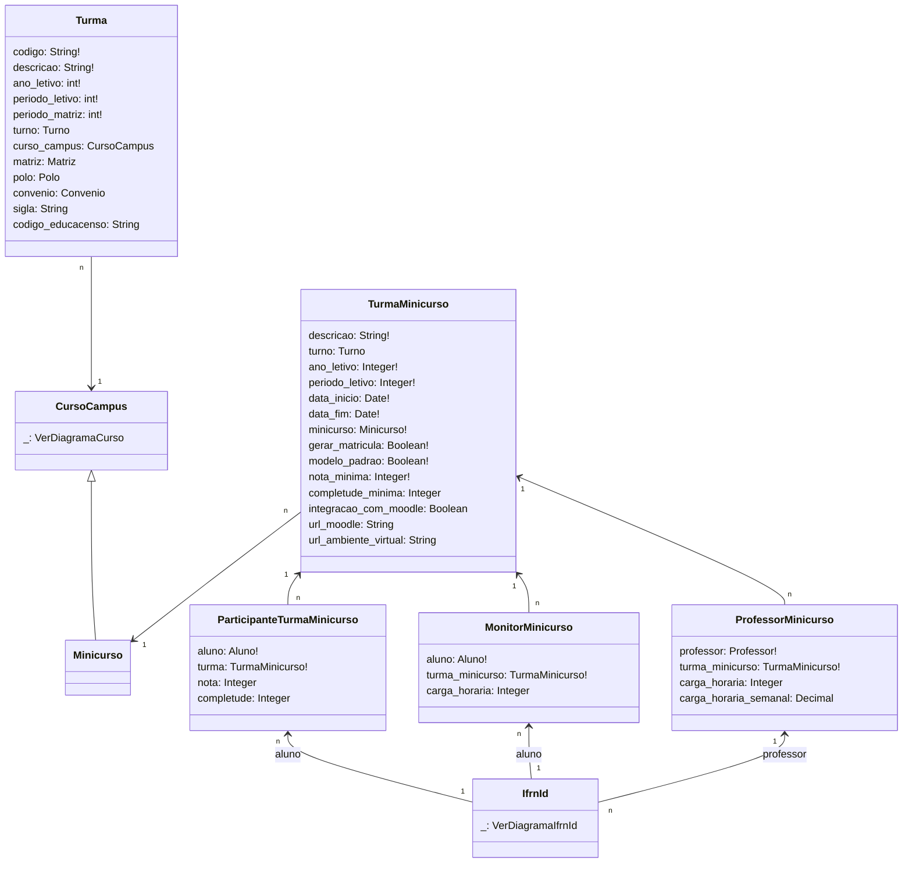

# SUAP Edu

## Turma - Digrama

## Observações

1. Os models abaixo não foram utilizados pois não pareceram ter relevância para a integração:
   1. `edu.cadastros_gerais.Turno`
   2. `edu.cadastros_gerais.Convenio`
   3. `edu.polos.Polo`
