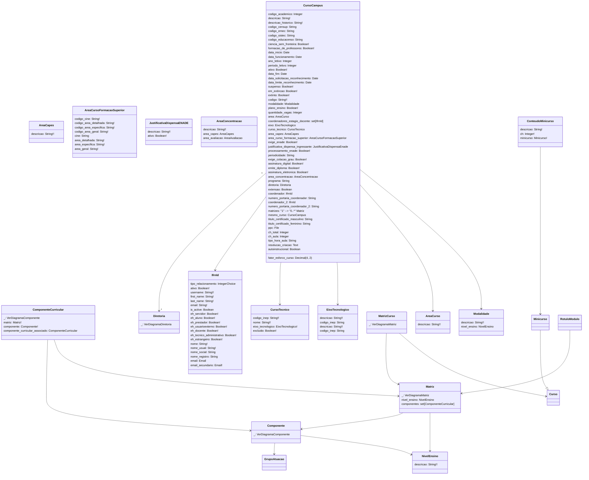

# SUAP Edu

## Curso - Digrama

> **Curso**
> 1. periodo_letivo= `[[1, '1'], [2, '2']]`
> 2. periodicidade= `[[1, 'Anual'], [2, 'Semestral'], [3, 'Livre']]`
> 3. tipo_hora_aula= `[[45, '45 min'], [60, '60 min']]`