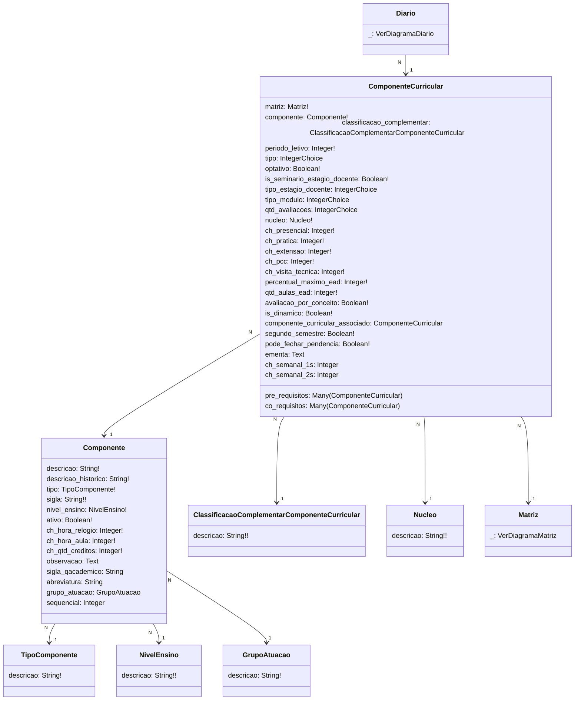

# SUAP Edu

## Componente - Digrama

> **ComponenteCurricular**
> 1. tipo = `[[1, 'Regular'], [2, 'Seminário'], [3, 'Prática Profissional'], [4, 'Trabalho de Conclusão de Curso'], [5, 'Atividade de Extensão'], [6, 'Prática como Componente Curricular'], [7, 'Visita Técnica / Aula da Campo'], [8, 'Componentes Extracurriculares']]`
> 2. tipo_estagio_docente = `[[1, 'Estágio Docente I'], [2, 'Estágio Docente II'], [3, 'Estágio Docente III'], [4, 'Estágio Docente IV'], [5, 'Estágio Docente de Matriz Anterior']]`
> 3. tipo_modulo = `[[1, 'Módulo I'], [2, 'Módulo II'], [3, 'Módulo III'], [4, 'Módulo IV'], [5, 'Módulo V'], [6, 'Módulo VI'], [7, 'Módulo VII'], [8, 'Módulo VIII'], [9, 'Módulo IX'], [10, 'Módulo X'], [11, 'Módulo XI'], [12, 'Módulo XII']]`
> 4. qtd_avaliacoes = `[[0, 'Zero'], [1, 'Uma'], [2, 'Duas'], [3, 'Três'], [4, 'Quatro']]`

## Curso - Digrama

```mermaid
classDiagram
    class Componente {
        descricao: String!
        descricao_historico: String!
        tipo: TipoComponente!
        sigla: String!!
        nivel_ensino: NivelEnsino!
        ativo: Boolean!

        ch_hora_relogio: Integer!
        ch_hora_aula: Integer!
        ch_qtd_creditos: Integer!

        observacao: Text
        sigla_qacademico: String
        abreviatura: String

        grupo_atuacao: GrupoAtuacao

        sequencial: Integer
    }
    class ComponenteCurricular {
        %% Dados gerais
        matriz: Matriz!
        componente: Componente!
        classificacao_complementar: ClassificacaoComplementarComponenteCurricular
        periodo_letivo: Integer!
        tipo: IntegerChoice
        optativo: Boolean!
        is_seminario_estagio_docente: Boolean!
        tipo_estagio_docente: IntegerChoice
        tipo_modulo: IntegerChoice
        qtd_avaliacoes: IntegerChoice
        nucleo: Nucleo!

        %% Carga horária
        ch_presencial: Integer!
        ch_pratica: Integer!
        ch_extensao: Integer!
        ch_pcc: Integer!
        ch_visita_tecnica: Integer!
        percentual_maximo_ead: Integer!
        qtd_aulas_ead: Integer!

        %% Pré requisitos
        pre_requisitos: "1" --> "0..*" ComponenteCurricular

        %% Co-requisitos
        co_requisitos: "1" --> "0..*" ComponenteCurricular

        avaliacao_por_conceito: Boolean!
        is_dinamico: Boolean!
        componente_curricular_associado: ComponenteCurricular
        segundo_semestre: Boolean!
        pode_fechar_pendencia: Boolean!
        ementa: Text

        %% distribuição da quantidade de créditos do componente curricular anual no semestre
        ch_semanal_1s: Integer
        ch_semanal_2s: Integer
    }
    class ClassificacaoComplementarComponenteCurricular {
        descricao: String!!
    }
    class Matriz {
        %% Dados gerais
        descricao: String
        ano_criacao: Integer
        periodo_criacao: Integer [[1, '1'], [2, '2']]
        ativo: Boolean
        data_inicio: Date
        data_fim: Date 
        ppp: File 
        ppc: File 
        qtd_periodos_letivos: Integer [[x, x] for x in range(1, 13)])
        nivel_ensino: NivelEnsino 
        natureza_participacao: NaturezaParticipacao 

        %% Carga horária
        ch_componentes_obrigatorios: Integer
        ch_componentes_optativos: Integer
        ch_componentes_eletivos: Integer
        ch_seminarios: Integer
        ch_pratica_profissional: Integer
        ch_atividades_complementares: Integer
        ch_atividades_aprofundamento: Integer
        ch_componentes_extensao: Integer
        ch_componentes_tcc: Integer
        ch_pratica_como_componente: Integer
        ch_visita_tecnica: Integer
        ch_atividades_extensao: Integer
        ch_componentes_com_extensao: Integer

        componentes: Many[Componente(ComponenteCurricular)]

        inconsistente: Boolean
        exige_tcc: Boolean
        permite_etapas_componente_tcc: Boolean

        observacao: Text 

        %% Estágio
        exige_estagio: Boolean 
        ch_minima_estagio: Integer 
        periodo_minimo_estagio_obrigatorio: IntegerChoice
        periodo_minimo_estagio_nao_obrigatorio: IntegerChoice

        requer_vinculacao_extensao_diarios: Boolean!

        %% certificação parcial
        emite_certificacao_parcial: Boolean!
        certificado_parcial_acumulavel: Boolean!
    }
    class CursoTecnico{
        codigo_inep: String!!
        nome: String!!
        eixo_tecnologico: EixoTecnologico!
        excluido: Boolean!
    }
    class CursoCampus{
        %% Identificação
        codigo_academico: Integer
        descricao: String!
        descricao_historico: String!
        codigo_censup: String
        codigo_emec: String
        codigo_sistec: String
        codigo_educacenso: String
        ciencia_sem_fronteira: Boolean!
        formacao_de_professores: Boolean!

        %% Dados da funcionamento
        data_inicio: Date
        data_funcionamento: Date
        ano_letivo: Integer
        periodo_letivo: Integer
        ativo: Boolean!

        %% Outros Dados
        data_fim: Date
        data_solicitacao_reconhecimento: Date
        data_limite_reconhecimento: Date
        suspenso: Boolean!
        em_extincao: Boolean!
        extinto: Boolean!

        codigo: String!!
        modalidade: Modalidade
        plano_ensino: Boolean!
        quantidade_vagas: Integer

        %% cursos Licenciatura
        area: AreaCurso
        coordenadores_estagio_docente: "1" --> "0..*" IfrnId
        %% cursos tecnológicos ou FIC
        eixo: EixoTecnologico

        %% cursos técnicos concomitantes e subsequentes
        curso_tecnico: CursoTecnico

        %% cursos de pós-graduação
        area_capes: AreaCapes

        area_curso_formacao_superior: AreaCursoFormacaoSuperior

        exige_enade: Boolean!
        justificativa_dispensa_ingressante: JustificativaDispensaEnade 
        processamento_enade: Boolean!

        periodicidade: StringChoice
        exige_colacao_grau: Boolean!
        assinatura_digital: Boolean!
        emite_diploma: Boolean!
        assinatura_eletronica: Boolean!
        area_concentracao: AreaConcentracao
        programa: String
        diretoria: Diretoria
        extensao: Boolean
        coordenador: IfrnId
        numero_portaria_coordenador: String
        coordenador_2: IfrnId
        numero_portaria_coordenador_2: String
        matrizes: "1" --> "0..*" Matriz
        mesmo_curso: CursoCampus

        %% Titulo do certificado de conclusão
        titulo_certificado_masculino: String
        titulo_certificado_feminino: String

        %% Atributo de Minicurso
        ppc: File 
        ch_total: Integer
        ch_aula: Integer
        tipo_hora_aula: StringChoice
        resolucao_criacao: Text

        fator_esforco_curso: Decimal(4, 2)

        %% Autoinstrucional
        autoinstrucional: Boolean

    }

    class MatrizCurso {
        curso_campus: CursoCampus!
        matriz: Matriz!

        %% Ato normativo
        resolucao_criacao: Text
        resolucao_data: Date
        %% Ato de reconhecimento
        reconhecimento_texto: Text
        reconhecimento_data: Date
        unique_together = [('matriz', 'curso_campus')]
    }
    class RotuloModulo {
        matriz: Matriz
        descricao: String!
        tipo_modulo: IntegerChoice!

        unique_together = [('matriz', 'tipo_modulo')]
    }
    class Minicurso {
    }
    class ConteudoMinicurso {
        descricao: String!
        ch: Integer!
        minicurso: Minicurso!
    }
    class Modalidade {
        descricao: String!!
        nivel_ensino: NivelEnsino
    }
    class AreaCurso {
        descricao: String!!
    }
    class EixoTecnologico {
        descricao: String!!
        codigo_inep: String
    }
    class NivelEnsino {
        descricao: String!!
    }
    class IfrnId {
        tipo_relacionamento: IntegerChoice
        ativo: Boolean!
        username: String!!
        first_name: String!
        last_name: String!
        email: String!
        is_active: Boolean
        eh_servidor: Boolean!
        eh_aluno: Boolean!
        eh_prestador: Boolean!
        eh_usuarioexterno: Boolean!
        eh_docente: Boolean!
        eh_tecnico_administrativo: Boolean!
        eh_estrangeiro: Boolean!
        nome: String!
        nome_usual: String!
        nome_social: String
        nome_registro: String
        email: Email
        email_secundario: Email!
    }
    class TipoComponente{
        descricao: String!
    }
    class NaturezaParticipacao {
        descricao: String!!
    } 
    class Nucleo{
        descricao: String!!
    }
    class Turma{
        codigo: String!
        descricao: String!
        ano_letivo: int!
        periodo_letivo: int!
        periodo_matriz: int!
        turno: Turno
        curso_campus: CursoCampus
        matriz: Matriz
        polo: Polo
        convenio: Convenio
        sigla: String
        codigo_educacenso: String
    }
    class TurmaMinicurso{
        descricao: String!
        turno: Turno
        ano_letivo: Integer!
        periodo_letivo: Integer!
        data_inicio: Date!
        data_fim: Date!
        minicurso: Minicurso!
        gerar_matricula: Boolean!
        modelo_padrao: Boolean!
        nota_minima: Integer!
        completude_minima: Integer
        integracao_com_moodle: Boolean
        url_moodle: String
        url_ambiente_virtual: String
    }
    class Convneio{
        descricao: String!!
    }
    class Polo{
        descricao: String!
        sigla: String!
    }
    class ParticipanteTurmaMinicurso{
        aluno: Aluno!
        turma: TurmaMinicurso!
        nota: Integer
        completude: Integer
    }
    class MonitorMinicurso{
        aluno: Aluno!
        turma_minicurso: TurmaMinicurso!
        carga_horaria: Integer
    }
    class ProfessorMinicurso{
        professor: IfrnId!
        turma_minicurso: TurmaMinicurso!
        carga_horaria: Integer
        carga_horaria_semanal: Decimal
    }
    class Diario{
        turma: Turma!
        componente_curricular: ComponenteCurricular!
        percentual_minimo_ch: PositiveInteger!
        ano_letivo: int!
        periodo_letivo: int!
        quantidade_vagas: int!
        situacao: int!
        horario_campus: HorarioCampus!
        turno: Turno!
        estrutura_curso: EstruturaCurso!
        calendario_academico: CalendarioAcademico!
        local_aula: Sala
        local_laboratorio: Sala
        locais_aula_secundarios: ManySala
        descricao_dinamica: String
        segundo_semestre: Boolean!
        integracao_com_moodle: Boolean!
        url_moodle: String
        url_ambiente_virtual: String
        ignorar_choque_horario_renovacao_matricula: BooleanField!
        posse_etapa_1: int!
        posse_etapa_2: int!
        posse_etapa_3: int!
        posse_etapa_4: int!
        posse_etapa_5: int!
        entregue_fisicamente: Boolean
        possui_segunda_oferta: Boolean!
        diario_primeira_oferta: Diario
    }
    class ProfessorDiario{
        diario: Diario!
        professor: IfrnId!
        tipo: TipoProfessorDiario!
        data_inicio_etapa_1: Date
        data_fim_etapa_1: Date
        data_inicio_etapa_2: Date
        data_fim_etapa_2: Date
        data_inicio_etapa_3: Date
        data_fim_etapa_3: Date
        data_inicio_etapa_4: Date
        data_fim_etapa_4: Date
        data_inicio_etapa_final: Date
        data_fim_etapa_final: Date
        ativo: Boolean!
        financiamento_externo: Boolean!
        percentual_ch: Integer
        periodo_letivo_ch: Integer
    }
    class TipoProfessorDiario{
        descricao: String!!
    }
    class ConfiguracaoAvaliacao{
        diario: Diario
        etapa: Integer
        forma_calculo: Integer!
        divisor: Integer
        maior_nota: Boolean!
        menor_nota: Boolean!
        autopublicar: Boolean!
        observacao: String
    }
    class ItemConfiguracaoAvaliacao{
        configuracao_avaliacao: ConfiguracaoAvaliacao!
        tipo: int!
        sigla: String
        descricao: String!
        data: Date
        nota_maxima: int
        peso: int
    }
    class NotaAvaliacao{
        matricula_diario: MatriculaDiario!
        item_configuracao_avaliacao: ItemConfiguracaoAvaliacao!
        nota: Nota
    }
    class Aula{
        professor_diario: ProfessorDiario!
        etapa: Integer!
        quantidade: Integer!
        url: String
        data: Date
        conteudo: TextField
        tipo: Integer
        ead: Boolean!
        outros_professor_diario: Many(ProfessorDiario)
        registro_frequencia_confirmado: Boolean!
    }
    class Falta{
        matricula_diario: MatriculaDiario!
        aula: Aula!
        quantidade: Integer!
        abono_faltas: AbonoFaltas
        contabilizar: Boolean!
    }

    Componente --> TipoComponente
    Componente --> NivelEnsino
    Componente --> GrupoAtuacao

    ComponenteCurricular --> Matriz
    ComponenteCurricular --> Componente
    ComponenteCurricular --> ClassificacaoComplementarComponenteCurricular
    ComponenteCurricular --> Nucleo

    CursoCampus --> Modalidade
    CursoCampus --> AreaCurso
    CursoCampus --> EixoTecnologico
    CursoCampus --> CursoTecnico
    CursoCampus --> IfrnId

    Matriz --> NivelEnsino
    Matriz --> NaturezaParticipacao
    Matriz --> Componente
    
    MatrizCurso --> Curso
    MatrizCurso --> Matriz

    RotuloModulo --> Matriz

    Minicurso --|> Curso

    ConteudoMinicurso --> Minicurso

    Turma --> Turno
    Turma --> CursoCampus
    Turma --> Polo
    Turma --> Convenio
    Turma --> Matriz

    TurmaMinicurso --> Turno
    TurmaMinicurso --> Minicurso

    ParticipanteTurmaMinicurso --> Aluno
    ParticipanteTurmaMinicurso --> TurmaMinicurso

    MonitorMinicurso --> Aluno
    MonitorMinicurso --> TurmaMinicurso

    ProfessorMinicurso --> IfrnId
    ProfessorMinicurso --> TurmaMinicurso

    Diario --> Turma
    Diario --> ComponenteCurricular
    Diario --> HorarioCampus
    Diario --> Turno
    Diario --> EstruturaCurso
    Diario --> CalendarioAcademico
    Diario --> Sala

    ProfessorDiario --> Diario
    ProfessorDiario --> Professor
    ProfessorDiario --> TipoProfessorDiario

    NotaAvaliacao --> MatriculaDiario
    NotaAvaliacao --> ItemConfiguracaoAvaliacao

    ItemConfiguracaoAvaliacao --> ConfiguracaoAvaliacao

    ConfiguracaoAvaliacao --> Diario

    Falta --> MatriculaDiario
    Falta --> Aula
    Falta --> AbonoFaltas

    Aula --> ProfessorDiario
    Aula --> ProfessorDiario

```

> **ComponenteCurricular**
> 1. tipo = `[[1, 'Regular'], [2, 'Seminário'], [3, 'Prática Profissional'], [4, 'Trabalho de Conclusão de Curso'], [5, 'Atividade de Extensão'], [6, 'Prática como Componente Curricular'], [7, 'Visita Técnica / Aula da Campo'], [8, 'Componentes Extracurriculares']]`
> 2. tipo_estagio_docente = `[[1, 'Estágio Docente I'], [2, 'Estágio Docente II'], [3, 'Estágio Docente III'], [4, 'Estágio Docente IV'], [5, 'Estágio Docente de Matriz Anterior']]`
> 3. tipo_modulo = `[[1, 'Módulo I'], [2, 'Módulo II'], [3, 'Módulo III'], [4, 'Módulo IV'], [5, 'Módulo V'], [6, 'Módulo VI'], [7, 'Módulo VII'], [8, 'Módulo VIII'], [9, 'Módulo IX'], [10, 'Módulo X'], [11, 'Módulo XI'], [12, 'Módulo XII']]`
> 4. qtd_avaliacoes = `[[0, 'Zero'], [1, 'Uma'], [2, 'Duas'], [3, 'Três'], [4, 'Quatro']]`

> **Curso**
> 1. periodo_letivo= `[[1, '1'], [2, '2']]`
> 2. periodicidade= `[[1, 'Anual'], [2, 'Semestral'], [3, 'Livre']]`
> 3. tipo_hora_aula= `[[45, '45 min'], [60, '60 min']]`

> **Matriz**
> 1. periodo_minimo_estagio_obrigatorio=`[['', '------']] + [[x, x] for x in range(1, 11)]`
> 2. periodo_minimo_estagio_nao_obrigatorio= `[['', '------']] + [[x, x] for x in range(1, 11)]`

> **RotuloModulo**
> 1. tipo_modulo=`[[1, 'Módulo I'], [2, 'Módulo II'], [3, 'Módulo III'], [4, 'Módulo IV'], [5, 'Módulo V'], [6, 'Módulo VI'], [7, 'Módulo VII'], [8, 'Módulo VIII'], [9, 'Módulo IX'], [10, 'Módulo X'], [11, 'Módulo XI'], [12, 'Módulo XII']]`

> **IfrnId**
> 1. tipo_relacionamento= `['SERVIDOR' 'PRESTADOR' 'ALUNO' 'PESSOA_JURIDICA' 'PESSOA_EXTERNA']`

> **Diario**
> 1. situacao=`[[1, 'Aberto'], [2, 'Fechado']]`
> 2. posse_etapa_1, posse_etapa_2, posse_etapa_3, posse_etapa_4, posse_etapa_5=`[[1, 'Professor'], [0, 'Registro Escolar']]`
> 3. etapa=`[[1, 'Etapa 1'], [2, 'Etapa 2'], [3, 'Etapa 3'], [4, 'Etapa 4'], [5, 'Etapa Final']]`

> **ItemConfiguracaoAvaliacao**
> 1. tipo=`[[1, 'Trabalho'], [2, 'Seminário'], [3, 'Teste'], [4, 'Prova'], [5, 'Atividade'],  [6, 'Exercício'], [7, 'Atitudinal']]`

> **ConfiguracaoAvaliacao**
> 1. tipo=[[1, 'Soma Simples'], [2, 'Média Aritmética'], [3, 'Média Ponderada'], [4, 'Maior Nota'], [5, 'Soma com Divisor Informado'], [6, 'Média Atitudinal'], [7, 'Avaliação por Conceito']]

> **Aula**
> 1. etapa=`[[1, 'Primeira'], [2, 'Segunda'], [3, 'Terceira'], [4, 'Quarta'], [5, 'Final']]`
> 2. tipo=`[[1, 'Teórica'], [2, 'Prática'], [3, 'Extensão'], [4, 'Prática como Componente Curricular'], [5, 'Visita Técnica/Aula de Campo']]`

