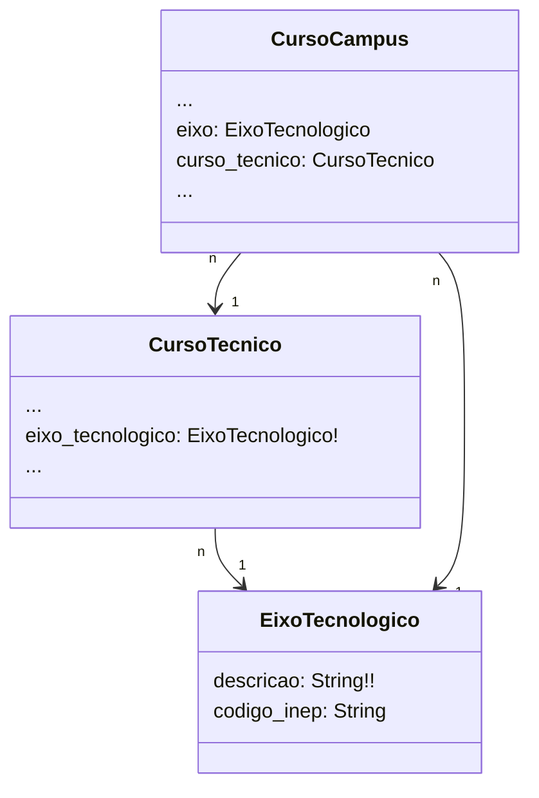
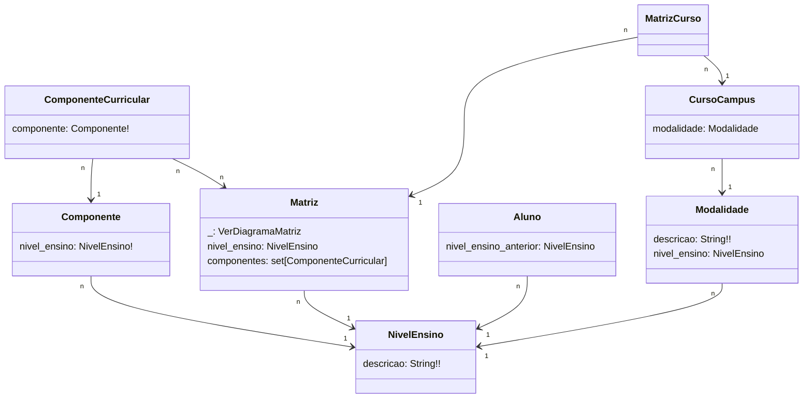

# SUAP Edu

Referências ambíguas.

## EixoTecnologico - Digrama

Dada uma matrícula em um diário, é possível identificar o `EixoTecnologico` de 2 formas, qual usar?

1. `Matricula -> Diario -> Turma -> CursoCampus -> EixoTecnologico`
2. `Matricula -> Diario -> Turma -> CursoCampus -> CursoTecnico -> EixoTecnologico`

## NivelEnsino - Digrama

Dada uma matrícula em um diário, é possível identificar o `NivelEnsino` de 4 formas, qual usar?

1. `Matricula -> Diario -> Turma -> CursoCampus -> Modalidade -> NivelEnsino`
2. `Matricula -> Diario -> Turma -> CursoCampus -> MatrizCurso -> Matriz -> NivelEnsino`
3. `Matricula -> Diario -> Turma -> CursoCampus -> MatrizCurso -> Matriz -> ComponenteCurricular -> Componente -> NivelEnsino`
4. `Matricula -> Aluno -> NivelEnsino`
