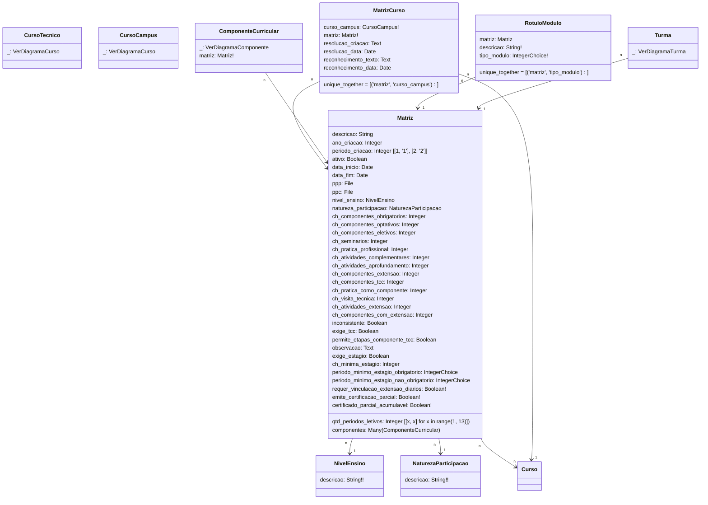

# SUAP Edu

## Componente - Digrama

> **Matriz**
> 1. periodo_minimo_estagio_obrigatorio=`[['', '------']] + [[x, x] for x in range(1, 11)]`
> 2. periodo_minimo_estagio_nao_obrigatorio= `[['', '------']] + [[x, x] for x in range(1, 11)]`

> **RotuloModulo**
> 1. tipo_modulo=`[[1, 'Módulo I'], [2, 'Módulo II'], [3, 'Módulo III'], [4, 'Módulo IV'], [5, 'Módulo V'], [6, 'Módulo VI'], [7, 'Módulo VII'], [8, 'Módulo VIII'], [9, 'Módulo IX'], [10, 'Módulo X'], [11, 'Módulo XI'], [12, 'Módulo XII']]`
