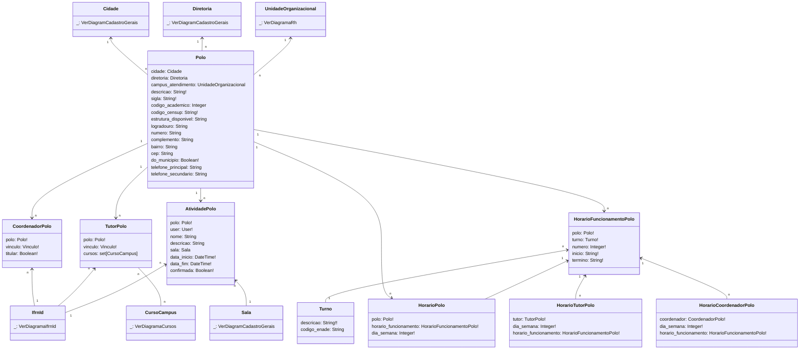

# SUAP Edu

## Curso - Digrama

> **HorarioPolo**, **HorarioCoordenadorPolo** e **HorarioTutorPolo**
> 1. dia_semana=`[[1, 'Segunda'], [2, 'Terça'], [3, 'Quarta'], [4, 'Quinta'], [5, 'Sexta'], [6, 'Sábado'], [7, 'Domingo']]`

> **HorarioFuncionamentoPolo**
> 1. numero=`[[1, '1'], [2, '2'], [3, '3'], [4, '4'], [5, '5'], [6, '6']]`