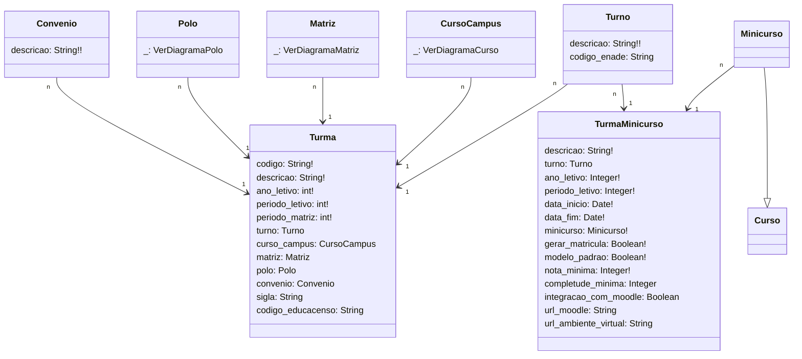

# SUAP Edu

## Curso - Digrama

```mermaid
classDiagram
    class Turma{
        codigo: String!
        descricao: String!
        ano_letivo: int!
        periodo_letivo: int!
        periodo_matriz: int!
        turno: Turno
        curso_campus: CursoCampus
        matriz: Matriz
        polo: Polo
        convenio: Convenio
        sigla: String
        codigo_educacenso: String
    }

    class Turno{
        descricao: String!!
        codigo_enade: String
    }
    class CursoCampus {
        _: VerDiagramaCurso
    }
    class Matriz {
        _: VerDiagramaMatriz
    }
    class Polo {
        _: VerDiagramaPolo
    }
    class Convenio{
        descricao: String!!
    }

    class Minicurso {
    }
    class TurmaMinicurso{
        descricao: String!
        turno: Turno
        ano_letivo: Integer!
        periodo_letivo: Integer!
        data_inicio: Date!
        data_fim: Date!
        minicurso: Minicurso!
        gerar_matricula: Boolean!
        modelo_padrao: Boolean!
        nota_minima: Integer!
        completude_minima: Integer
        integracao_com_moodle: Boolean
        url_moodle: String
        url_ambiente_virtual: String
    }

    Turno "n" --> "1" Turma
    CursoCampus "n" --> "1" Turma
    Matriz "n" --> "1" Turma
    Polo "n" --> "1" Turma
    Convenio "n" --> "1" Turma

    Minicurso "n" --> "1" TurmaMinicurso
    Turno "n" --> "1" TurmaMinicurso

    Minicurso --|> Curso

```